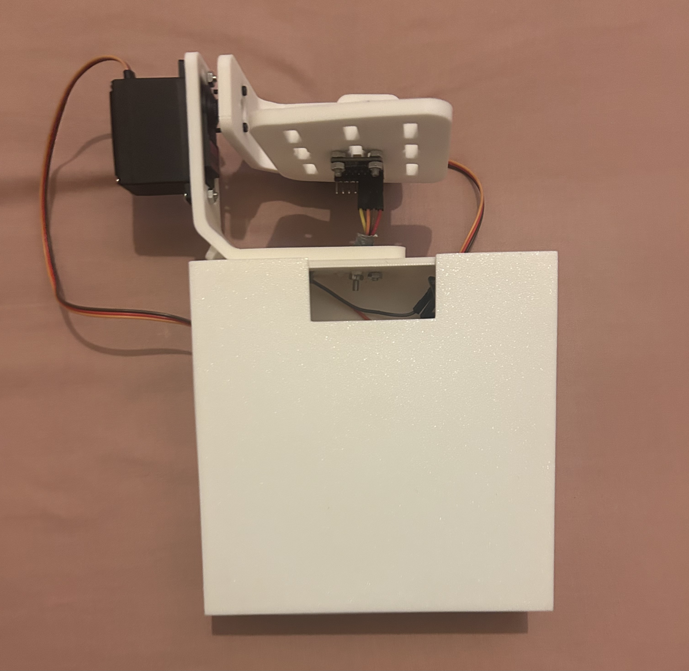
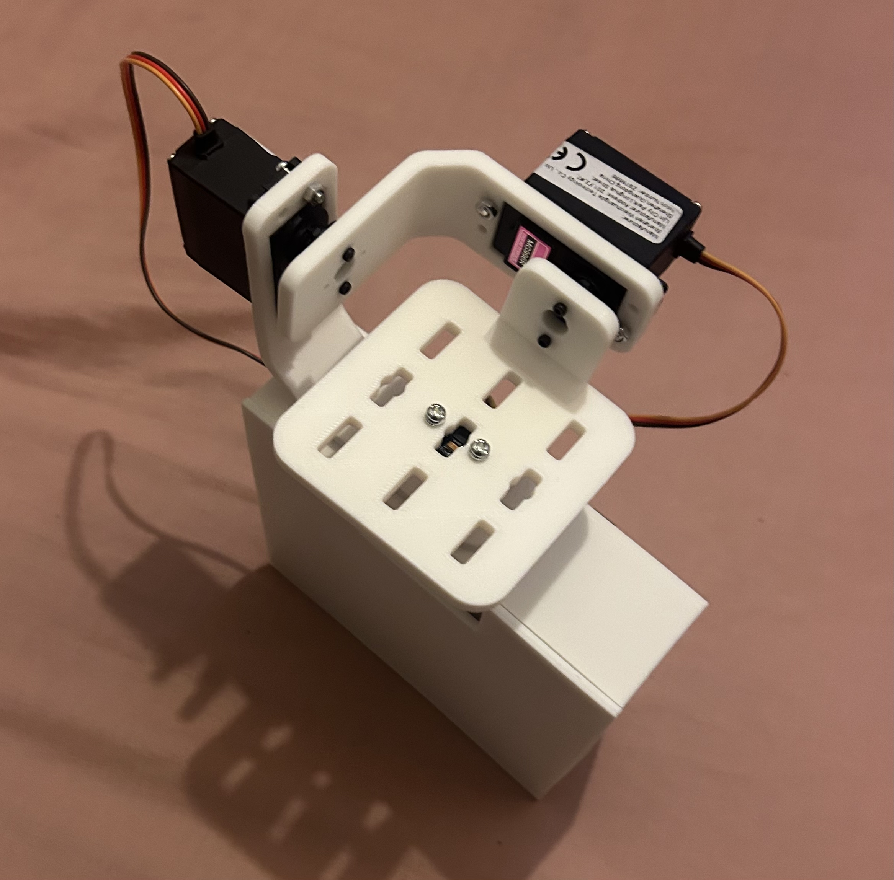

# ESP32 Self-Levelling Gimbal

ESP32-based two-axis self-levelling gimbal using an MPU6050 IMU, two MG996R servos, complementary filtering, PID control, a live WiFi dashboard, a custom KiCad carrier PCB, and a modified 3D printed frame.

The project was developed to practise embedded control, sensor fusion, PID tuning, servo actuation, browser-based telemetry, PCB design, Fusion 360 CAD, 3D printing, and physical system integration.

> **Manufacturing support:** PCB fabrication and 3D printed parts were supported by **PCBWay** through its student/non-profit project sponsorship programme.

---

## Final Result

The completed prototype performs **limited-angle dual-axis roll and pitch correction**.

The MPU6050 measures the moving platform angle. The ESP32 combines accelerometer and gyroscope data using a complementary filter, calculates roll and pitch corrections using PID control, and commands the two servos around calibrated mechanical neutral positions.

Servo travel was deliberately limited to approximately **±5° around each calibrated neutral position**. This kept the prototype stable within the available power and structural limits while still demonstrating genuine two-axis corrective movement.

### Final Demonstration

[](https://youtube.com/shorts/LKtvDuY0aLw)

The video shows:

- the completed prototype
- visible servo correction
- live roll and pitch values on the dashboard
- Serial Monitor angle and servo-command output
- limited-angle dual-axis response

---

## Final Build

<p align="center">
  
  
  
</p>

### Internal Electronics

<p align="center">
  
  
</p>

---

## Project Summary

The project controls a two-axis platform using live roll and pitch data from an MPU6050.

The control pipeline is:

```text
MPU6050
    ↓
Accelerometer + gyroscope readings
    ↓
Complementary filter
    ↓
Roll and pitch error
    ↓
PID control
    ↓
MG996R servo correction
```

The ESP32 also hosts a local browser dashboard for:

- live roll and pitch monitoring
- stabilisation mode
- roll and pitch setpoint control
- reset-to-flat control
- heartbeat-based fallback to stabilisation mode

A custom KiCad carrier PCB replaced the final breadboard wiring while keeping the ESP32 and MPU6050 removable.

---

## Current Status

- [x] Wokwi simulation completed
- [x] MPU6050 angle measurement implemented
- [x] Complementary filter implemented
- [x] PID control implemented
- [x] Roll and pitch servo control implemented
- [x] WiFi dashboard implemented
- [x] Dashboard setpoint control implemented
- [x] Reset-to-flat control implemented
- [x] Heartbeat safety system implemented
- [x] Real breadboard test completed
- [x] KiCad schematic completed
- [x] KiCad PCB layout completed
- [x] PCB DRC passed
- [x] Carrier PCB manufactured
- [x] Fusion 360 frame modifications completed
- [x] Electronics enclosure and lid designed
- [x] 3D printed parts manufactured
- [x] PCB soldered and assembled
- [x] Final mechanical assembly completed
- [x] Mechanical neutral offsets calibrated
- [x] Limited-angle dual-axis PID response tested
- [x] Final demonstration video recorded

---

## Features

- Two-axis roll and pitch correction
- MPU6050 accelerometer and gyroscope sensing
- Complementary filtering
- Independent roll and pitch PID control
- Two MG996R servos
- Calibrated mechanical neutral offsets
- Restricted servo travel for stable prototype operation
- ESP32-hosted WiFi dashboard
- Live roll and pitch telemetry
- Browser setpoint control
- Reset-to-flat command
- Dashboard heartbeat safety fallback
- Custom KiCad carrier PCB
- Remote MPU6050 connector
- Separate 5 V servo rail
- 1000 µF bulk capacitor
- Socketed ESP32
- Modified Fusion 360 frame
- 3D printed electronics enclosure
- Removable enclosure lid
- External power switch
- M3 PCB mounting hardware

---

## Hardware Used

| Component                      | Purpose                                       |
| ------------------------------ | --------------------------------------------- |
| ESP32 Dev Board                | Main controller and WiFi dashboard server     |
| MPU6050 IMU                    | Measures platform roll and pitch              |
| MG996R Servo x2                | Controls roll and pitch axes                  |
| MT3608 Boost Converter         | Boosts battery voltage to the servo rail      |
| Parallel 18650 Battery Holder  | Portable servo power source                   |
| 1000 µF Electrolytic Capacitor | Reduces short servo-rail voltage disturbances |
| 100 nF Ceramic Capacitors      | Local decoupling                              |
| Custom KiCad Carrier PCB       | Permanent carrier and interconnection board   |
| Jumper and Servo Wires         | Connects servos and remote IMU                |
| 3D Printed Gimbal Frame        | Supports the two-axis mechanism               |
| 3D Printed Electronics Box     | Holds PCB, batteries and power electronics    |
| Removable 3D Printed Lid       | Covers the electronics enclosure              |
| M3 Screws, Nuts and Washers    | PCB and frame fastening                       |
| Small Servo-Horn Screws        | Connects servo horns to printed parts         |

---

## Final Pin Connections

| Module      | Pin    | ESP32 / Power Connection    |
| ----------- | ------ | --------------------------- |
| MPU6050     | SDA    | GPIO 21                     |
| MPU6050     | SCL    | GPIO 22                     |
| MPU6050     | VCC    | ESP32 3.3 V                 |
| MPU6050     | GND    | Common GND                  |
| Roll Servo  | Signal | GPIO 13                     |
| Pitch Servo | Signal | GPIO 19                     |
| Servos      | VCC    | External regulated 5 V rail |
| Servos      | GND    | External GND rail           |
| ESP32       | USB    | USB power and programming   |
| ESP32       | GND    | Common GND                  |

Remote IMU connector order:

```text
SDA
SCL
GND
3V3
```

Servo connector order:

```text
SIG
5V
GND
```

---

## Breadboard Prototype

The system was validated on a breadboard before designing the carrier PCB.


The breadboard stage was used to verify:

- ESP32 and MPU6050 communication
- servo directions
- complementary-filter behaviour
- PID response
- WiFi dashboard operation
- power-rail separation

---

## Simulation

The project was first developed in Wokwi before moving to physical hardware.

<p align="center">
  
  
</p>

### Simulated Dashboard


The simulation was used to validate:

- firmware structure
- MPU6050 angle calculations
- servo response logic
- dashboard design
- setpoint control
- heartbeat fallback

---

## Carrier PCB Development

The custom carrier PCB was designed in KiCad after breadboard testing.

### Initial Schematic


### Final Schematic

<p align="center">
  
  
</p>

### PCB Routing

<p align="center">
  
  
</p>

### 3D PCB Preview


The PCB includes:

- ESP32 socket headers
- roll servo header
- pitch servo header
- remote MPU6050 header
- external servo-power input
- 1000 µF bulk capacitor
- 100 nF decoupling capacitors
- labelled silkscreen
- M3 mounting holes
- removable modules and connectors

---

## Manufactured PCB

### Bare PCB

<p align="center">
  
  
  
</p>

### Assembled PCB


The ESP32 plugs into female headers and can be removed without desoldering. The MPU6050 also connects through a removable four-wire cable.

---

## Mechanical CAD

The original mechanical geometry was based on the HowToMechatronics self-stabilising platform and modified in Fusion 360.

### Full Assembly


### Individual CAD Parts

<p align="center">
  
  
  
</p>

<p align="center">
  
  
</p>

Main mechanical changes included:

- removal of the unused yaw axis
- revised MG996R mounting
- custom electronics enclosure
- removable friction-fit lid
- PCB mounting holes
- battery and boost-converter space
- USB, servo, switch and IMU cable cutouts
- revised platform-to-servo-horn attachment

---

## 3D Printed Parts

<p align="center">
  
  
</p>

The parts were manufactured using:

```text
Material: PLA
Process: FDM
Infill: 60%
Units: mm
```

### Mechanical Limitation

The printed brackets and platform showed some flex and slight deformation under load.

Software neutral offsets were used to compensate for the assembled resting angle:

```cpp
constexpr int ROLL_NEUTRAL = 99;
constexpr int PITCH_NEUTRAL = 85;
```

These offsets correct the resting position but do not eliminate the underlying structural flex.

---

## Power Architecture

The ESP32 is powered separately through USB during development and demonstration.

The servos use an external 5 V rail because MG996R servos can draw significantly more current than the ESP32 should supply.

```text
Parallel 18650 cells
        ↓
MT3608 boost converter
        ↓
5 V servo rail
        ↓
Roll and pitch servos

ESP32 USB GND ───────── Common GND
Servo supply GND ────── Common GND
MPU6050 GND ─────────── Common GND
```

The carrier PCB includes:

- external 5 V and GND input
- 1000 µF bulk capacitor
- 100 nF decoupling capacitors
- 1.0 mm 5 V and GND traces
- 0.4 mm 3.3 V trace
- 0.3 mm signal traces

### Power Limitation

The final prototype became unstable during large or aggressive servo movements because the power system could not reliably support the resulting current transients.

The validated prototype therefore uses restricted servo travel:

```cpp
constexpr int ROLL_NEUTRAL = 99;
constexpr int PITCH_NEUTRAL = 85;

constexpr int ROLL_MIN_POSITION = ROLL_NEUTRAL - 5;
constexpr int ROLL_MAX_POSITION = ROLL_NEUTRAL + 5;

constexpr int PITCH_MIN_POSITION = PITCH_NEUTRAL - 5;
constexpr int PITCH_MAX_POSITION = PITCH_NEUTRAL + 5;
```

A future revision would use a higher-current 5-6 V BEC or buck-boost supply and stiffer printed brackets.

---

## WiFi Dashboard

The ESP32 connects to the local WiFi network and hosts the dashboard directly.

For real hardware:

```cpp
const char* ssid = "YOUR_WIFI_SSID";
const char* password = "YOUR_WIFI_PASSWORD";
```

After startup, the ESP32 prints its IP address in Serial Monitor.

Open:

```text
http://ESP32_IP_ADDRESS
```

The PC or phone must be connected to the same local network.

> Do not commit real WiFi credentials to the public repository.

---

## Dashboard Modes

### Stabilise Mode

The default mode holds a target roll and pitch of 0° relative to startup calibration.

```text
Error = target angle - filtered measured angle
```

### Setpoint Control Mode

The browser sliders change the requested roll and pitch targets.

This mode is useful for:

- checking servo directions
- verifying both axes
- testing target-angle control
- demonstrating remote interaction

### Heartbeat Safety

The browser sends a repeated heartbeat while setpoint mode is active.

If the heartbeat stops, the ESP32 returns to stabilisation mode.

---

## PID Control

Final prototype baseline:

| Axis  |  Kp |  Ki |  Kd |
| ----- | --: | --: | --: |
| Roll  | 1.5 | 0.0 | 0.1 |
| Pitch | 1.5 | 0.0 | 0.1 |

`Ki` was left at zero because integral correction was not required for the limited-angle demonstration.

`Kd` was used to reduce settling oscillation after movement.

The gains are prototype-specific because response depends on:

- printed-part stiffness
- platform mass
- servo geometry
- centre of gravity
- power stability
- wiring drag

---

## Calibration and Startup

The assembled platform must remain level and still during startup calibration.

1. Place the base on a stable surface.
2. Support the moving platform near level.
3. Power the system.
4. Keep the IMU completely still during calibration.
5. Wait for WiFi connection and Serial Monitor output.
6. Remove the support.
7. Apply only small, controlled disturbances.

The startup orientation becomes the sensor reference.

---

## Problems Faced and Fixes

| Problem                                         | Fix / Engineering Decision                                     |
| ----------------------------------------------- | -------------------------------------------------------------- |
| Dashboard layout was too wide                   | Reworked CSS layout and sizing                                 |
| Browser could leave system in setpoint mode     | Added heartbeat fallback                                       |
| GPIO12 caused boot-related concerns             | Moved pitch signal to GPIO19                                   |
| Servos required high current                    | Added separate 5 V rail and 1000 µF capacitor                  |
| MPU6050 needed to measure the moving platform   | Added remote four-pin IMU connector                            |
| ESP32 needed to remain reusable                 | Used two 1x15 female socket headers                            |
| Original model included an unnecessary yaw axis | Reduced design to roll and pitch                               |
| Original handle did not fit the electronics     | Designed a separate electronics enclosure                      |
| Printed frame sagged under load                 | Added independent roll and pitch neutral offsets               |
| Platform was slightly deformed                  | Calibrated assembled resting position in software              |
| Large servo movement caused instability         | Restricted both axes to ±5° around neutral                     |
| Settling response oscillated after movement     | Reduced gains and adjusted derivative damping                  |
| OLED added unnecessary integration complexity   | Removed OLED and retained dashboard + Serial Monitor telemetry |

---

## Known Limitations

- Servo travel is restricted to a narrow operating envelope.
- Large or aggressive disturbances can exceed the available servo power.
- The PLA structure has visible compliance and small alignment errors.
- Startup calibration requires the platform to be held level and still.
- The current prototype demonstrates correction rather than precision stabilisation.
- The OLED planned in early versions was removed from the final build.
- A higher-current regulator and stiffer mechanical revision would be required for wider-range operation.

---

## Software

Built using PlatformIO in VS Code with the Arduino framework.

### `platformio.ini`

```ini
[env:esp32dev]
platform = espressif32
board = esp32dev
framework = arduino
monitor_speed = 115200
lib_deps =
    electroniccats/MPU6050
    madhephaestus/ESP32Servo
```

---

## How to Run

1. Clone the repository.
2. Open it in VS Code.
3. Install PlatformIO.
4. Add local WiFi credentials without committing them.
5. Connect the ESP32 through USB.
6. Build and upload the firmware.
7. Open Serial Monitor at `115200` baud.
8. Keep the platform level and still during calibration.
9. Read the ESP32 IP address.
10. Open the IP address in a browser on the same network.
11. Test only small roll and pitch disturbances with the current power system.

---

## Repository Structure

```text
ESP32-Self-Levelling-Gimbal/
├── cad/
│   └── exported-print-files/
├── docs/
│   └── images/
│       ├── Back Of PCB .png
│       ├── Bird eye.gif
│       ├── Both Sides of PCB.png
│       ├── Brackets and table.png
│       ├── BreadBoard Prototype.png
│       ├── cad_base_pitch_servo_bracket.png
│       ├── cad_electronics_box.png
│       ├── cad_electronics_lid.png
│       ├── cad_roll_servo_bracket.png
│       ├── cad_stabilizing_platform.png
│       ├── Diagonal.gif
│       ├── Electronics Box.png
│       ├── ESP32 Intial Gimbal Schematic PCB.png
│       ├── ESP32_Gimbal CAD_Assembly.png
│       ├── ESP32_Gimbal PCB_Preview.png
│       ├── Front Of PCB.png
│       ├── front.gif
│       ├── Full PCB.gif
│       ├── Inside.gif
│       ├── KiCad PCB Editor Close Up.png
│       ├── KiCad PCB Editor.png
│       ├── KiCad PCB Schematic Close Up.png
│       ├── KiCad PCB Schematic.png
│       ├── Simulated Dashboard.png
│       ├── Wokwi Circuit.png
│       └── Wokwi With Values.png
├── include/
├── lib/
├── src/
│   └── main.cpp
├── test/
├── diagram.json
├── platformio.ini
├── wokwi.toml
└── README.md
```

---

## Future Improvements

- Replace the MT3608 system with a higher-current 5-6 V BEC or buck-boost converter.
- Use thicker and stiffer printed brackets.
- Improve cable routing and strain relief.
- Increase the validated servo range gradually.
- Add quantitative disturbance and settling-time tests.
- Store WiFi credentials in an ignored `secrets.h`.
- Add automatic calibration validation.
- Add data logging for angle error and PID output.

---

## Author

**Farhan Ali**  
Engineering Student / Embedded Systems Project

- GitHub: [farhan10904](https://github.com/farhan10904)
- Portfolio: [Farhan Ali Engineering Portfolio](https://pacific-attention-6cd.notion.site/Farhan-Ali-Engineering-Portfolio-2c0495dbdc658028a0decf9447459ea6#367495dbdc65808eb791f741fc051231)
- LinkedIn: [Farhan Ali](https://www.linkedin.com/in/farhan-ali-95047a245/)

Built as an independent project covering embedded systems, control systems, PCB design, CAD, additive manufacturing, hardware debugging, and prototype validation.

---

## Acknowledgements

PCB fabrication and 3D printed-part manufacturing were supported by PCBWay through its student/non-profit project sponsorship programme.

The original mechanical geometry was based on the HowToMechatronics project:

[DIY Arduino Gimbal | Self-Stabilizing Platform](https://howtomechatronics.com/projects/diy-arduino-gimbal-self-stabilizing-platform/)

The design was adapted for an ESP32-based control system with a custom PCB, revised electronics enclosure, remote MPU6050, WiFi dashboard, modified power system, and revised mechanical layout.

AI tools were used for planning, debugging assistance, code review, and documentation editing. Hardware selection, circuit changes, PID testing, PCB decisions, CAD modifications, mechanical assembly, fault isolation, and final validation were performed and reviewed by the author.
